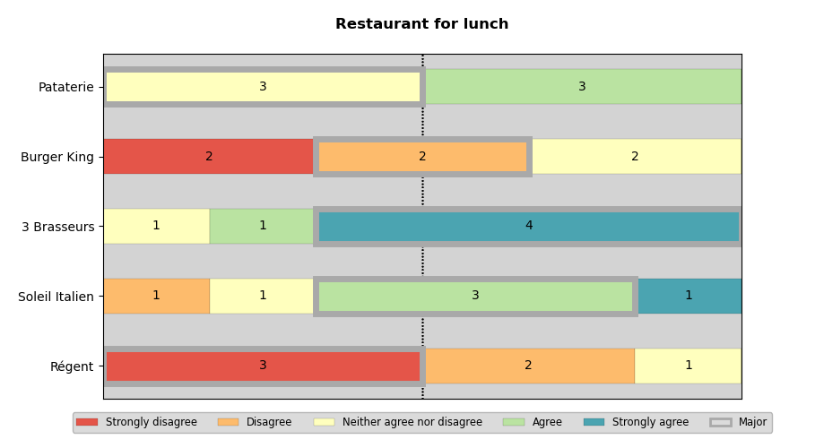
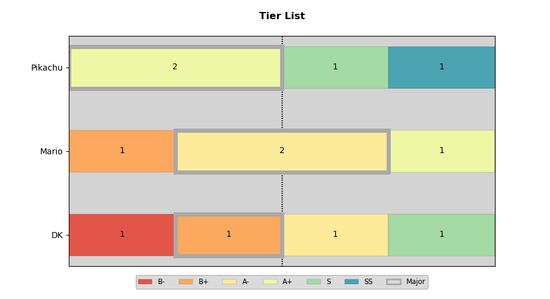
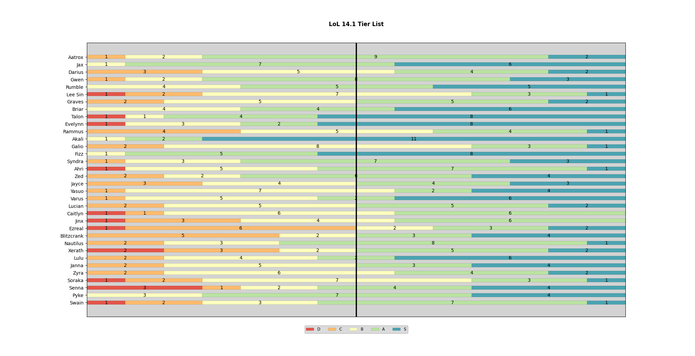

# Majority Judgment


This Python script is designed to create Majority Judgment graphs, providing a
visual representation of collective decision-making outcomes.

For more informations about Majority Judgment: https://en.wikipedia.org/wiki/Majority_judgment

For instructions and details on using this with a **Discord Bot**, please refer to the [README](discord-bot/README.md) in the `discord-bot` directory.

# Requirements

* python 3.7+
* matplotlib 3.4.2+
* pandas 2.0+
* disnake 2.9+ (optional)

# Usage

```
usage: majority_judgment.py [-h] -c CSV [-t TITLE] [-l {en,fr}] [-T {int,str}] [-C [CATEGORIES ...]]

Generate a Majority Judgment bar chart from CSV data.

Examples of CSV files formats:

    Q1,Q2,Q3    Q1,Q2,Q3
    3,3,3       C,C,C
    2,4,1       D,B,E
    5,5,1       A,A,E
    1,2,2       E,D,D

Examples of usages:
    ./majority_judgment.py -c resto.csv
    ./majority_judgment.py -c resto.csv -l fr -t 'Restaurants'
    ./majority_judgment.py -c resto.csv -C 'Too bad' 'Bad' 'Okay' 'Good' 'Very good'
    ./majority_judgment.py -c tier-list.csv -C B- B+ A- A+ S SS -T str -t 'Tier List'

options:
  -h, --help            show this help message and exit
  -c CSV, --csv CSV     Path to the CSV file containing survey data.
  -p, --png             Write a PNG file instead of plotting results.
  -t TITLE, --title TITLE
                        Title of the chart.
  -I {True,False}, --ignore-first-column {True,False}
                        Ignores the first column of the csv data                  
  -l {en,fr}, --lang {en,fr}
                        Change the language. (default: "en")
  -T {int,str}, --type {int,str}
                        Change the type of the categories values. (default: "int")
  -C [CATEGORIES ...], --categories [CATEGORIES ...]
                        Override the categories list. (ascending order)
  -D, --disable-major   Remove major selection display.
```

# Examples

```
./majority_judgment.py -t "Restaurants for lunch" -c resto.csv
```



```
./majority_judgment.py -c tier-list.csv -C B- B+ A- A+ S SS -T str -t 'Tier List'
```



```
./majority_judgment.py --disable-major -c tier_list_lol.csv -T str -C D C B A S -t 'LoL 14.1 Tier List'
```

