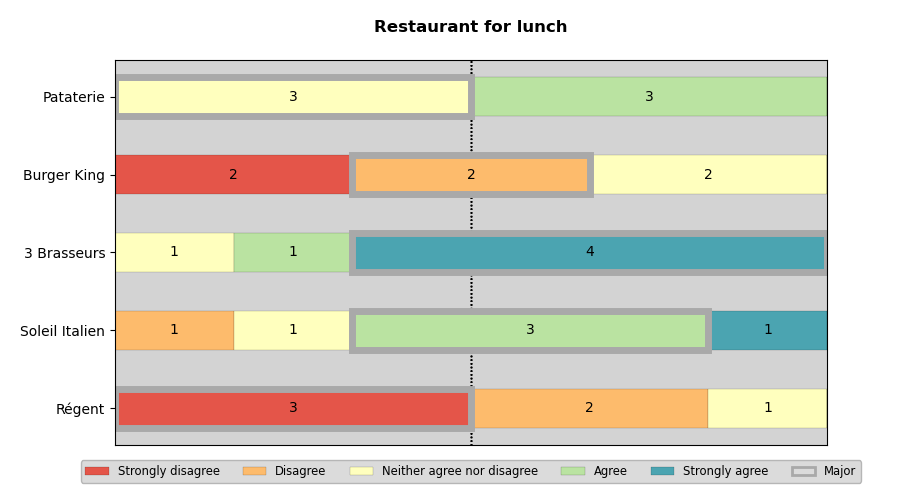

# Majority Judgment

This Python script is designed to create Majority Judgment graphs, providing a
visual representation of collective decision-making outcomes.

For more informations about Majority Judgment: https://en.wikipedia.org/wiki/Majority_judgment

# Requirements

* python 3.7+
* matplotlib 3.4.2+
* pandas 2.0+

# Usage

```
usage: majority-judgment.py [-h] -c CSV [-t TITLE] [-l {en,fr}] [-C [CATEGORIES ...]]

Generate a Majority Judgment bar chart from CSV data.

Example of CSV file format:

    Q1,Q2,Q3
    3,3,3
    2,4,1
    5,5,1
    1,2,2

options:
  -h, --help            show this help message and exit
  -c CSV, --csv CSV     Path to the CSV file containing survey data.
  -t TITLE, --title TITLE
                        Title of the chart.
  -l {en,fr}, --lang {en,fr}
                        Change the language. (default: "en")
  -C [CATEGORIES ...], --categories [CATEGORIES ...]
                        Override the categories list. (ascending order)
                        Examples of --categories option:
                            ./majority-judgment.py --categories D C B A S
                            ./majority-judgment.py -C "Too bad" "Bad" "Okay" "Good" "Very good"
```

# Example

```
./majority-judgment.py -t "Restaurants for lunch" -c resto.csv
```


