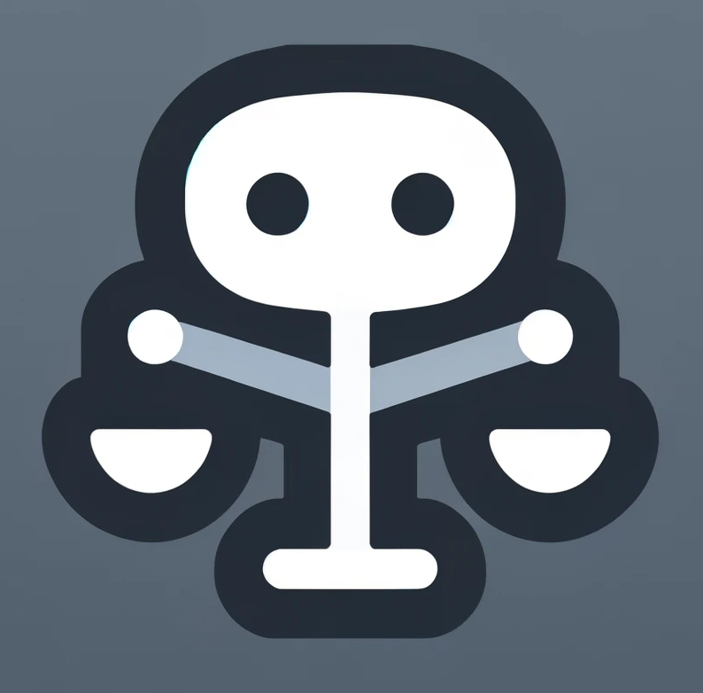
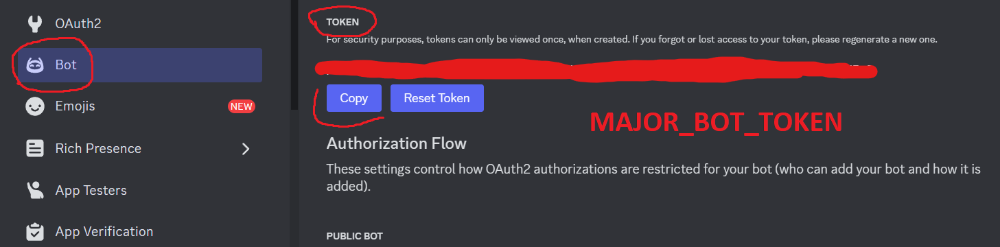
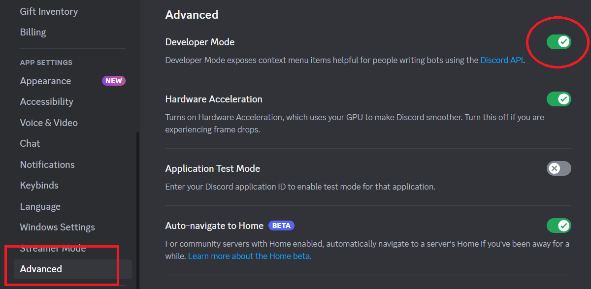
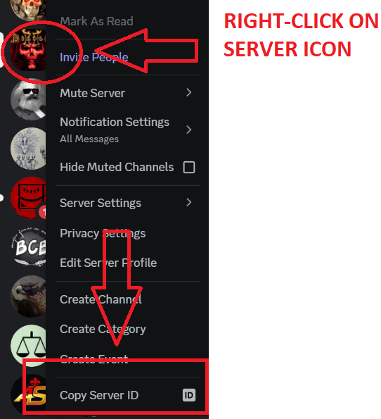
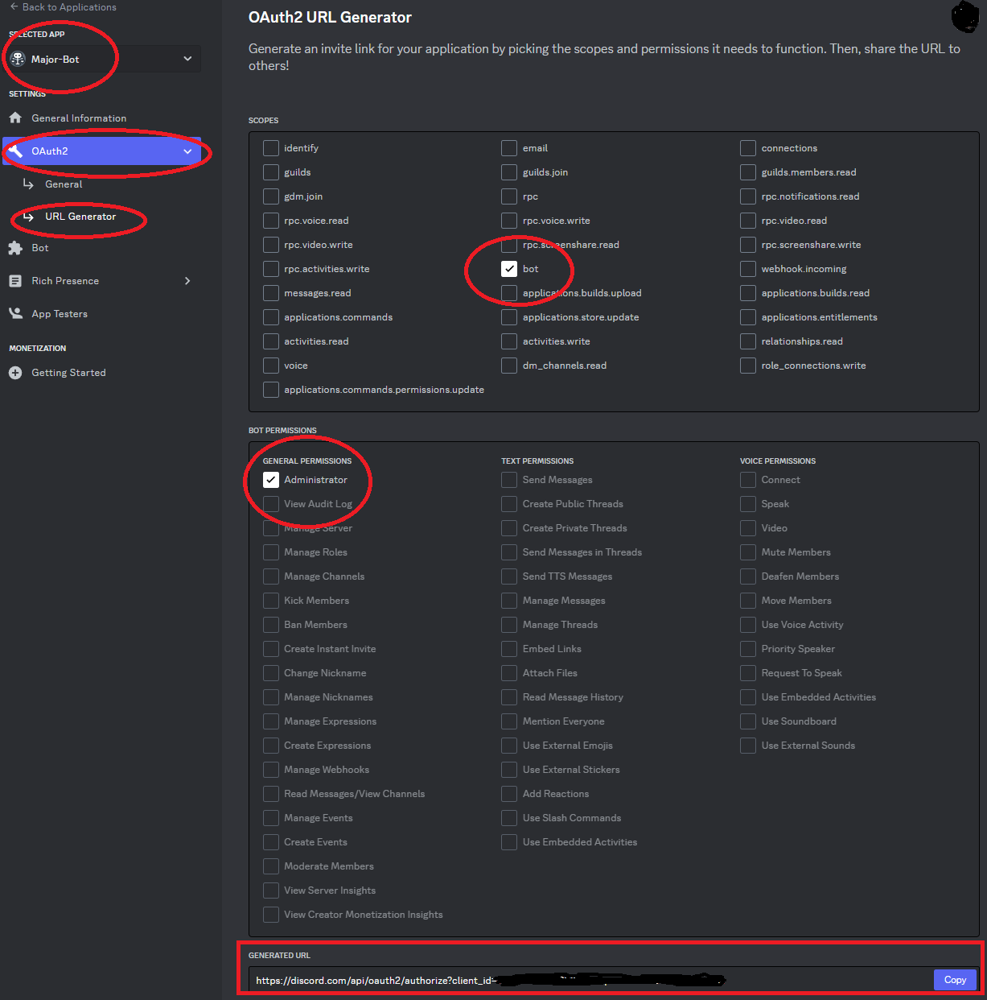

# Major Bot for Discord



This is a Discord bot script, `major_bot.py`, designed to interact with specific guilds on 
Discord. The bot is built using the `disnake` library, a fork of `discord.py` that adds 
support for Discord's interactions API.

This bot is dedicated to https://github.com/adrien-cotte/majority-judgment project.

## Prerequisites

### Discord bot knowledge

If you are not familiar with a Discord bot management, then here is where you should start: https://discord.com/developers/docs/getting-started
The following sections can help you too:
- [How to get MAJOR_BOT_TOKEN](#how-to-get-major_bot_token)
- [How to get MAJOR_BOT_GUILDS](#how-to-get-major_bot_guilds)
- [How to invite bot to your Discord server](#how-to-invite-bot-to-your-discord-server)

### Python modules

Before you start, ensure you have Python installed on your system and the `disnake 2.9+`
library. You can install `disnake` using pip:

```bash
pip install disnake
```

Ensure to have Majority Judgment others dependencies: [README#requirements](../README.md#requirements)

## Configuration

The bot requires two environment variables for its configuration:

1. `MAJOR_BOT_TOKEN`: The bot's token for authentication with the Discord API. See [How to get MAJOR_BOT_TOKEN](#how-to-get-major_bot_token) for more details.

2. `MAJOR_BOT_GUILDS`: A comma-separated list of Discord Guild IDs where the bot will be 
active (keep empty for any server). See [How to get MAJOR_BOT_GUILDS](#how-to-get-major_bot_guilds) for more details.

## Setting Up Environment Variables

Set the environment variables in your terminal:

For Linux/macOS:

```bash
export MAJOR_BOT_GUILDS=123456789012345678,987654321098765432,...
export MAJOR_BOT_TOKEN=<YOUR_BOT_TOKEN>
```

For Windows (using Command Prompt):

```cmd
set MAJOR_BOT_GUILDS=123456789012345678,987654321098765432,...
set MAJOR_BOT_TOKEN=<YOUR_BOT_TOKEN>
```

## Running the Bot

Navigate to the directory containing `major_bot.py` and run the script:

```bash
./major_bot.py
```

Ensure that `major_bot.py` is executable. If it's not, you can make it executable on 
Linux/macOS with `chmod +x major_bot.py`.

## Commands Usage

### /major_create
- **Description**: Create a new Majority Judgment (only one at a time is allowed for now)
- **Options**:
  - *question*: The Majority Judgment purpose
  - *choices*: The Majority Judgment candidates/choices, separated by a semicolon (`;`)
- **Example**: `/major_create question: The best Discord API choices: JS;Java;Python`

### /major_display
- **Description**: Display the current Majority Judgment results
- **Options**:
  - *visibility*: Display results in a public or private message
- **Example**: `/major_display visibilité:privé`

### /major_delete
- **Description**: Delete the current Majority Judgment
- **Options**: N/A
- **Example**: `/major_delete`

## How to get MAJOR_BOT_TOKEN

Go to https://discord.com/developers/applications, then Setting -> General Information -> Public Key.



## How to get MAJOR_BOT_GUILDS

Got to your Discord app.
Then, be sure the Developer mode is activated.



Right-click of your server icon and select `Copy Server ID`.



## How to invite bot to your Discord server

Go to your Discord developers applications, select your bot, then click on OAuth2 -> URL Generator -> bot -> Administrator -> Generated URL.

